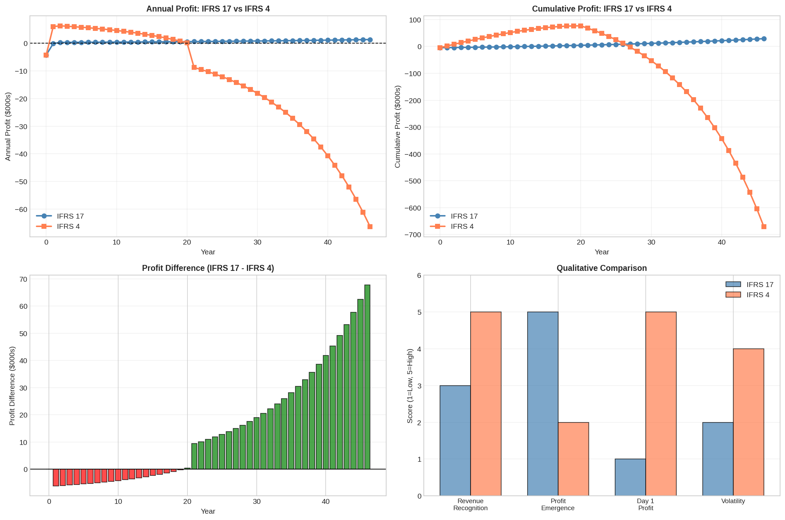
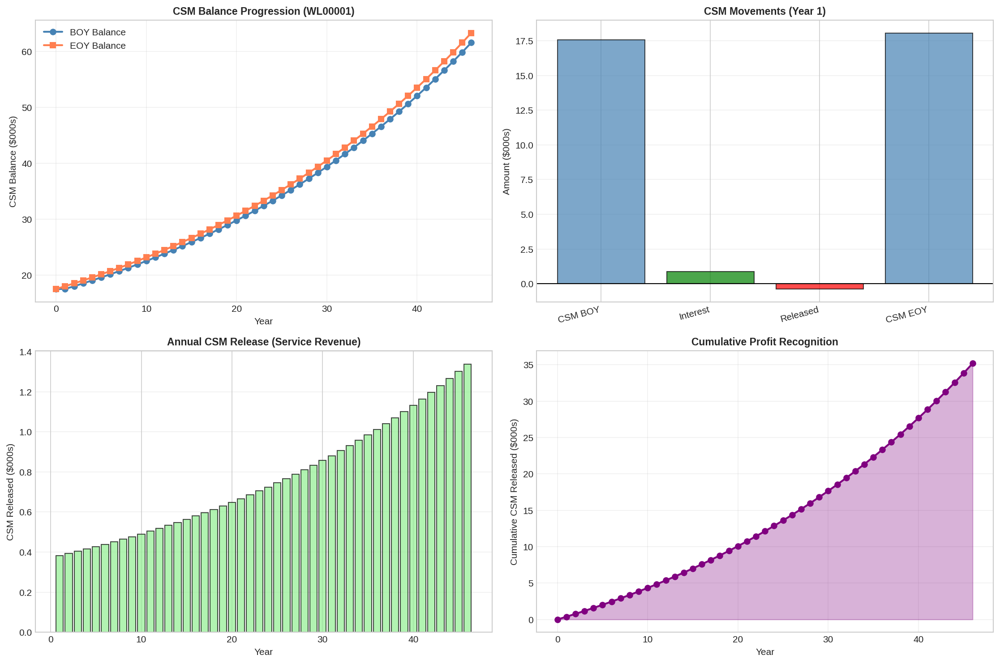
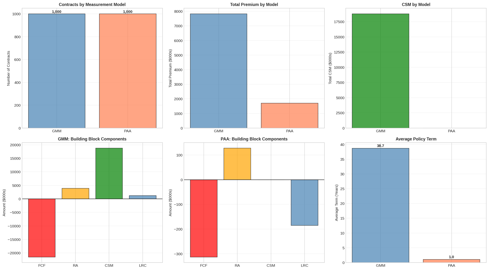

# IFRS 17 (PSAK 74) Actuarial Simulation Engine


## 📋 Executive Summary

This repository contains a Python-based actuarial framework designed to simulate the **IFRS 17 (International Financial Reporting Standard 17)** measurement models, adopted as **PSAK 74** in Indonesia.

Moving beyond traditional rule-based accounting (IFRS 4), this project implements the principles-based approach required by IFRS 17, focusing on the economic valuation of insurance contracts. The engine performs end-to-end calculations—from projecting **Fulfillment Cash Flows (FCF)** and estimating **Risk Adjustment (RA)** to determining the **Contractual Service Margin (CSM)** amortization.

It explicitly demonstrates the transition impact and profit emergence differences between the **General Measurement Model (GMM)** and the **Premium Allocation Approach (PAA)**.

## 🚀 Key Features

* **Dual Measurement Models:**
    * **GMM (General Measurement Model):** Implemented for long-term contracts (Whole Life, Term Life, Endowment).
    * **PAA (Premium Allocation Approach):** Implemented for short-term contracts (Motor, Property).
* **Actuarial Components:**
    * **Fulfillment Cash Flows:** Discounted probability-weighted cash flows.
    * **Risk Adjustment:** Calculated using a Cost of Capital (CoC) approach.
    * **CSM Engine:** Logic for initial recognition, unlocking, and periodic amortization based on coverage units.
* **Comparative Analysis:** Automated comparison between IFRS 4 (Reserves) and IFRS 17 (FCF + CSM) accounting bases.
* **Automated Visualization:** Generates 18+ comprehensive plots covering portfolio mix, profit signatures, and transition impacts.

## 📊 Visual Analysis Samples

*The following visualizations are generated automatically by the engine.*

### 1. Profit Emergence: IFRS 4 vs. IFRS 17
This chart highlights the fundamental shift in profit recognition. While IFRS 4 often allows upfront profit recognition (or implicit margins), IFRS 17 defers profit via the CSM, releasing it only as services are provided.



### 2. CSM Amortization Pattern
Visualizing the release of the Contractual Service Margin into the P&L over the life of the cohort.



### 3. GMM vs. PAA Methodology
A side-by-side comparison of liability measurements for different product types.



## 🛠️ Methodology & Actuarial Assumptions

To ensure intellectual transparency, this simulation utilizes the following specific assumptions. These are simplified proxies for illustration purposes and do not represent a real-world entity's confidential data.

| Component | Assumption / Method | Note |
| :--- | :--- | :--- |
| **Discount Rate (GMM)** | **5.0%** (Flat) | Proxy for long-term risk-free rate + illiquidity premium. |
| **Discount Rate (PAA)** | **3.0%** (Flat) | Lower rate for short-tail liabilities. |
| **Risk Adjustment** | **Cost of Capital (CoC)** | Calculated at **6%** CoC rate applied to projected Solvency Capital. |
| **Mortality Model** | **Makeham's Law** | $\mu_x = A + B \cdot c^x$ (Base $c=1.085$, capped at 0.95). |
| **Lapse Rates** | **Product Specific** | Varies from 8% (Endowment) to 25% (Motor). |
| **Expense Inflation** | **3.0%** p.a. | Applied to renewal expenses. |
| **Aggregation** | Contract Level | Aggregated to Portfolio Level for reporting. |

## 💻 How to Run

1.  Clone repository ini:
    ```bash
    git clone [https://github.com/username/IFRS17-Actuarial-Engine.git](https://github.com/username/IFRS17-Actuarial-Engine.git)
    ```
2.  Install dependencies:
    ```bash
    pip install -r requirements.txt
    ```
3.  Jalankan Jupyter Notebook:
    ```bash
    jupyter notebook notebooks/ifrs17_simulation.ipynb
    ```

## ⚠️ Disclaimer

Proyek ini dibuat untuk tujuan **edukasi dan demonstrasi kapabilitas modeling**. Hasil perhitungan bergantung penuh pada asumsi yang diinput dan penyederhanaan model. Tidak ditujukan untuk penggunaan produksi dalam pelaporan keuangan riil tanpa validasi aktuaria lebih lanjut.

---
*Created by rayan - linkedin.com/in/rosyidroyyan*
